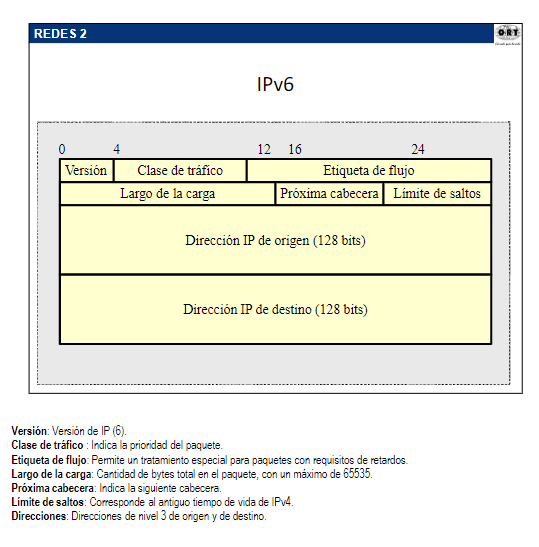

# OSPF

## Verificacion de funcionamiento

show ip protocols
show ip route
show ip ospf interface
show ip ospf
show ip ospf neighbor detail
show ip ospf database

## Tipos de routers

### Internos

Tienen todas sus interfaces en una misma area.

### Backbone

Al menos una interfaz en el area 0.
Mantiene info de ruteo

### Area borde (ABR)

Son los que tienen interfaces en distintas areas.
Mantienen link-state DB para cada area conectado
Rutea el trafico en las areas y se lo envia al backbone

### limite de AS (ASBR)

Routers que tienen al menos una interfaz dentro de una red externa

### Tipos de anuncios

- Tipo 1: Router link entry. Son los mensajes dentro del area
- Tipo 2: Network link entry. Son enviados por el DR y contienen sus vecindades.
- Tipo 3 y 4: Summary link entry. Tipo 3 resumen del area y tipo 4 indica el costo desde ABR a ASBR
- Tipo 5: AS external link entry. Rutas externas
  
## ISIS

- Protocolo de rapida convergecia
- Utilizado como IGP
- Altamente estable
- Utiliza eficientemente los recursos
- Mas facil implementar que OSPF
- Implantacion de IPV6

Pertenece a un area determina.
Tiene dos niveles de ruteo

- Nivel 1: Informacion topologica de todos los nododes del area
- Nivel 2: Se intercambia prefijos de diferentes areas

Niveles de Routers

- L1: construye topologia de area local
- L2 intercambian LSPs para construir topologia entre areas
- L1/L2: frontera entre dominios L1 y L2

## OSI NSAP

Los routers se identifican con una direcion NSAP

- Direccionamiento de Area (Tipicamente AFI=49)
- System ID: identificador del nodo (tipicamente direccion loopback en 6 bytes wwwx.xxyy.yzzz)
- NSQL: Identificador de servicio (siempre igual a 0)

## IPv6

Preferida: 2000:0:0:0:2C:FF:2001:010F
Comprimida 2000::2C:FF:2001:010F
Compatible con IPv4 0:0:0:0.0:0:192::168:10:1 o 0::192.168.10.1

Tipos de direcciones:

- Unicast (001): Identifican una interfaz (Globales, Enlace Local, Sitio Local)
- Anycast (1111 1110 10): Identifican un grupo de interfaces, se entregan a las mas proximas
- Multicast (1111 1110 11): Identifican un grupo de interfaces, y le entrega a todas
- Reservadas
